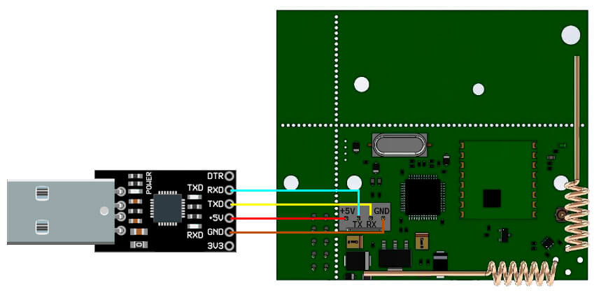

# Ajax2MQTT

**Note:** this project is not affiliated with Ajax Systems.

This app takes messages from [ajax security modules](https://ajax.systems) and sends them via MQTT, making possible to use Ajax devices in your Homeassistant or Homebridge, save telemetry to InfluxDB, etc.

It doesn’t use Ajax cloud services, doesn’t require internet connection and doesn’t expose any data outside of local network. However it requires special hardware module to interface Ajax wireless protocol (see [Required Hardware](#required-hardware) section below). Setting this module up is trivial and doesn't require special skills or tools.

### Supported devices
- [uartBridge](https://ajax.systems/products/uartbridge)
- [FireProtect](https://ajax.systems/products/fireprotect)
- [FireProtect Plus](https://ajax.systems/products/fireprotectplus)
- ~~MotionProtect (MotionProtect Plus)~~
- ~~DoorProtect~~
- ~~SpaceControl~~
- ~~GlassProtect~~
- ~~CombiProtect~~
- ~~LeaksProtect~~

## Required Hardware
- [Ajax uartBridge](https://ajax.systems/products/uartbridge) to interface wireless Ajax devices. Costs about $30 ([where to buy](https://ajax.systems/where-to-buy)).
- USB-TTL adapter. Any cheap adapter will work fine, I am using [this one](https://a.aliexpress.com/_mscVzYx). Costs about $1.
- Jumper wires with DuPont female-female connector. Sometimes they are included with usb-ttl adapter. Costs about another $1.
- Plastic enclosure box (optional). Minimal size is 60x60x15mm.

### Connecting everything together
- Connect **TX** pin on bridge to **RXD** pin on USB-UART adapter
- Connect **RX** pin on bridge to **TXD** pin on adapter
- Connect **GND** pins together
- Connect **+5V** pins together
- Plug the adapter into USB port on your computer



Some tips:

- Note that **transmitting** pin on the board (TX) must be connected to **receiving pin** on the adapter (RX), and not the other way around. These two connections must be crossed: rx -> tx and tx -> rx.
- +5v pin on adapter may also be called **VDD**.
- TX and RX pins on adapter my have D letter (e.g. TXD and RXD).

## Installation
The recommended installation method is with docker:

```bash
$ docker run \
    --name ajax2mqtt \
    --network=host \
    --restart=unless-stopped \
    --device=/dev/your-usb-ttl-adapter-address:/dev/ttyUSB0 \
    -e A2M_HASS_ENABLED=true \
    ingria/ajax2mqtt
```

The only line you need to change is `/dev/your-usb-ttl-adapter-address`.

For more complex setup, copy `docker-compose.example.yaml` to `docker-compose.yaml` and change environment variables there.

Available variables:

| Name | Default value | Description |
| ---- | ---- | ---- |
| A2M_SERIAL_PORT | `/dev/ttyUSB0` in docker, **none** in other environments | Path to usb ttl, e.g. /dev/ttyUSB0 |
| A2M_MQTT_ADDRESS | mqtt://127.0.0.1 | MQTT broker address |
| A2M_MQTT_PASSWORD | _none_ | MQTT broker password |
| A2M_MQTT_USERNAME | _none_ | MQTT broker username |
| A2M_MQTT_BASE_TOPIC| ajax2mqtt | Base topic to publish device states |
| A2M_HASS_ENABLED | false | Whether to enable homeassistant integration |
| A2M_HASS_BASE_TOPIC | homeassistant | Homeassistant base topic (used for last will and birth events) |
| A2M_LOG_LEVEL | error | Logging level |

## Integrations
MQTT communication is done with "integration" abstractions. Right now there are two: **base** and **homeassistant**, but it is possible to create more. Integration watches for device state and sends messages to MQTT broker. Also it listens for command topics and controls the physical devices.

### Base integration
Base integration sends **all** state changes to `ajax2mqtt/ID/state` topic and subscribes to the following command topics:

- ajax2mqtt/ID/arm
- ajax2mqtt/ID/disarm
- ajax2mqtt/ID/allow_join
- ajax2mqtt/ID/disallow_join
- ajax2mqtt/ID/unpair _device_id_
- ajax2mqtt/ID/set_offline_threshold _value_

You may control the device via these topics or create your own integration based on these topics (e.g. [use it in HomeBridge](https://github.com/arachnetech/homebridge-mqttthing/tree/master)).

### Homeassistant integration
This integration adds all your Ajax devices to Home Assistant, thanks to the MQTT discovery. If you don’t need this feature, you can set `A2M_HASS_ENABLED` config value to `false`.

## License
The Unlicense License. Please see [License File](LICENSE.md) for more information.
