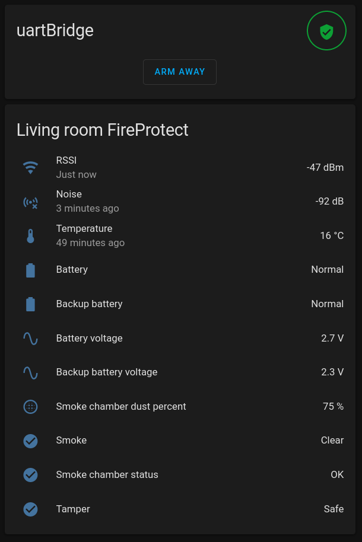

# Ajax2MQTT

**Note:** this project is not affiliated with Ajax Systems.

## What is it?
This app takes messages from [ajax security modules](https://ajax.systems) and sends them via MQTT, making possible to use Ajax devices in your Homeassistant or Homebridge, save telemetry to InfluxDB, etc.

It **doesn’t use Ajax cloud services**, doesn’t require internet connection and doesn’t expose any data outside of local network. However it requires special hardware module to interface Ajax wireless protocol (see [Required Hardware](#required-hardware) section below).

### Supported devices
- [uartBridge](https://ajax.systems/products/uartbridge)
- [FireProtect](https://ajax.systems/products/fireprotect)
- [FireProtect Plus](https://ajax.systems/products/fireprotectplus)
- ~~MotionProtect (MotionProtect Plus)~~
- ~~DoorProtect~~
- ~~SpaceControl~~
- ~~GlassProtect~~
- ~~CombiProtect~~
- ~~LeaksProtect~~

### Homeassistant integration
All your Ajax devices will be accessible in HASS thanks to the MQTT discovery. If you don’t need this feature, you can set `A2M_HASS_ENABLED` config value to `false`.



## Required Hardware
- [Ajax uartBridge](https://ajax.systems/products/uartbridge) to interface wireless Ajax devices. Costs about $30 ([where to buy](https://ajax.systems/where-to-buy)).
- USB-TTL adapter. Any cheap adapter will work fine, I am using [this one](https://a.aliexpress.com/_mscVzYx). Costs about $1.
- Jumper wires with DuPont female-female connector. Costs about $1. Sometimes they are included with usb-ttl adapter.

### Connecting everything together
- Connect **TX** pin on bridge to **RXD** pin on USB-UART adapter
- Connect **RX** pin on bridge to **TXD** pin on adapter
- Connect **GND** pins together
- Connect **+5V** pins together
- Plug the adapter into USB port on your computer

Some tips:
- Note that **transmitting** pin on the board (TX) must be connected to **receiving pin** on the adapter (RX), and not the other way around. These two connections must be crossed: rx -> tx and tx -> rx.
- +5v pin on adapter may also be called **VDD**.
- TX and RX pins on adapter my have D letter (e.g. TXD and RXD).

## Installation
I will use the [PM2](https://pm2.keymetrics.io/docs/usage/quick-start/) as an example, but you can use any process manager (upstart, systemd, etc).

**1. Clone the repository**
```
git clone https://github.com/ingria/ajax-security-mqtt
```

**2. Install the dependencies**
```
cd ajax2mqtt && npm install
```

**3. Change the config**
All configuration is done with environment variables. The only required variable is `A2M_SERIAL_PORT`, which contains path to usb ttl adapter (e.g. `/dev/usbTTY0).

Available variables:

| Name | Default value | Description |
| ---- | ---- | ---- |
| A2M_SERIAL_PORT | **none** | Path to usb ttl, e.g. /dev/ttyUSB0 |
| A2M_MQTT_ADDRESS | mqtt://127.0.0.1 | MQTT broker address |
| A2M_MQTT_PASSWORD | _none_ | MQTT broker password |
| A2M_MQTT_USERNAME | _none_ | MQTT broker username |
| A2M_MQTT_BASE_TOPIC| ajax2mqtt | Base topic to publish device states |
| A2M_HASS_ENABLED | false | Whether to enable homeassistant integration |
| A2M_HASS_BASE_TOPIC | homeassistant | Homeassistant base topic (userd for last will and birth events) |
| A2M_LOG_LEVEL | error | Logging level |

**4. Launch the process**
```
pm2 start --no-automation --name ajax-uart-bridge npm -- run start --prefix /path/to/ajax-security-mqtt/
```

## License
The Unlicense License. Please see [License File](LICENSE.md) for more information.
